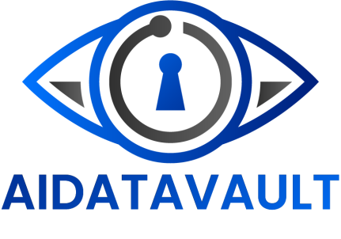
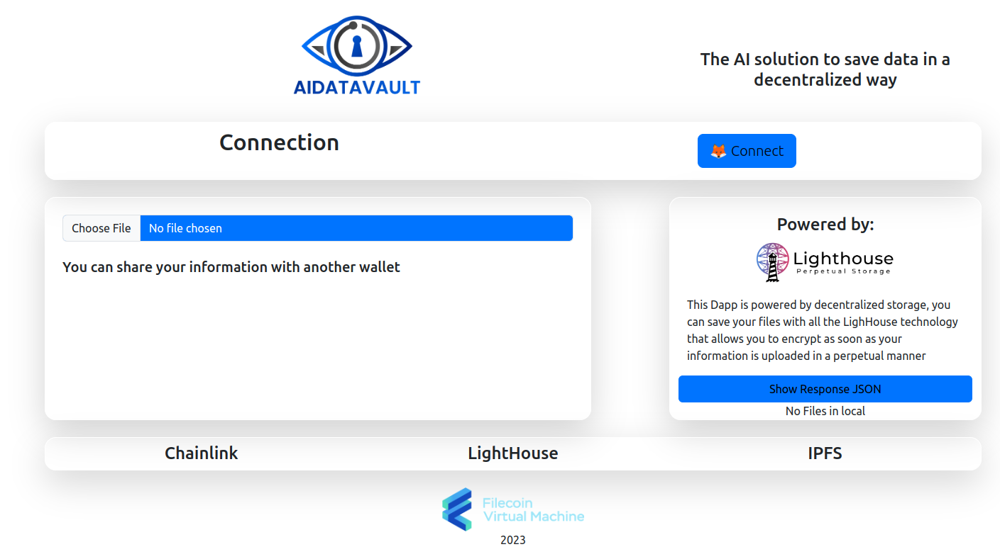
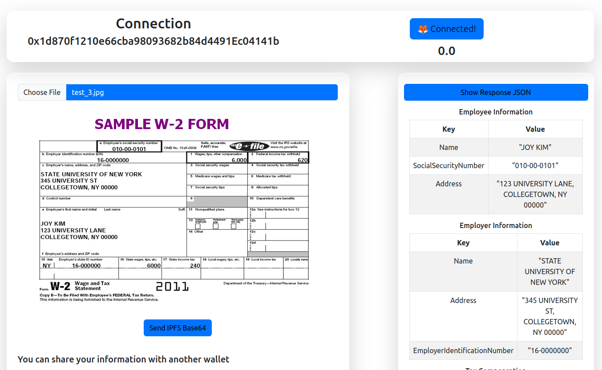
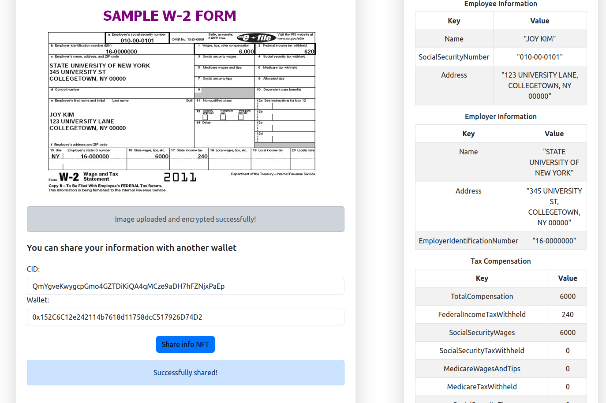

# Ai data vault

**AIDATAVAULT** is a revolutionary decentralized application (Dapp) that transforms data storage and access control using cutting-edge technology. By harnessing the power of decentralized storage and innovative LighHouse technology, AIDATAVAULT ensures secure, perpetual, and cross-platform data storage while enabling access control through non-fungible tokens (NFTs). This visionary project aims to reshape how individuals and organizations manage their data, ensuring privacy, security, and accessibility in blockchain networks.

## Used technology

This project uses the following technologies for its features:

### LightHouse

This Dapp is powered by decentralized storage, you can save your files with all the LighHouse technology that allows you to encrypt as soon as your information is uploaded in a perpetual manner.

### Chainlink

Chainlink as a tool to make the dapp interoperable between several blockchains

### Others tecnologies

- **Vision AI:** Extract characters from images with artificial intelligence
- **OpenAI:** Organize the plain text in a json to be able to display the text in a readable way in the dapp
- **FVM:** Deployed contract on FVM for Replication/Renewal-as-a-Service Starter Kit

## Backend repo

https://github.com/LuisFelipe09/data2023

## UI/UX

### Dapp without access:

### Dapp with acces:

### Dapp share data:

## Video demo

https://youtu.be/zrLX51L5obU

## Presentation

https://docs.google.com/presentation/d/1MxJ0jAooScLCZWK4fu-ThIywq-TGlD6LkaYQkkm_Q1c/edit?usp=sharing

## Available Scripts

In the project directory, you can run:

### `npm start`

Runs the app in the development mode.\
Open [http://localhost:3000](http://localhost:3000) to view it in your browser.

The page will reload when you make changes.\
You may also see any lint errors in the console.

### `npm test`

Launches the test runner in the interactive watch mode.\
See the section about [running tests](https://facebook.github.io/create-react-app/docs/running-tests) for more information.

### `npm run build`

Builds the app for production to the `build` folder.\
It correctly bundles React in production mode and optimizes the build for the best performance.

The build is minified and the filenames include the hashes.\
Your app is ready to be deployed!

See the section about [deployment](https://facebook.github.io/create-react-app/docs/deployment) for more information.

### `npm run eject`

**Note: this is a one-way operation. Once you `eject`, you can't go back!**

If you aren't satisfied with the build tool and configuration choices, you can `eject` at any time. This command will remove the single build dependency from your project.

Instead, it will copy all the configuration files and the transitive dependencies (webpack, Babel, ESLint, etc) right into your project so you have full control over them. All of the commands except `eject` will still work, but they will point to the copied scripts so you can tweak them. At this point you're on your own.

You don't have to ever use `eject`. The curated feature set is suitable for small and middle deployments, and you shouldn't feel obligated to use this feature. However we understand that this tool wouldn't be useful if you couldn't customize it when you are ready for it.
